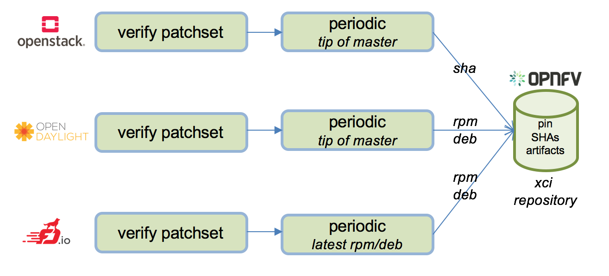
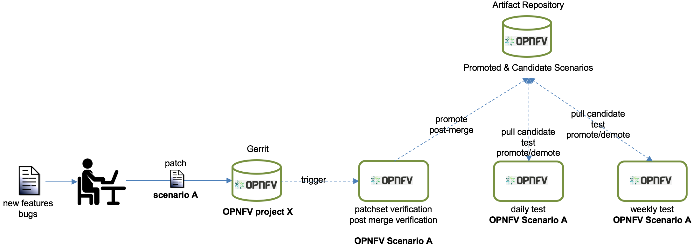
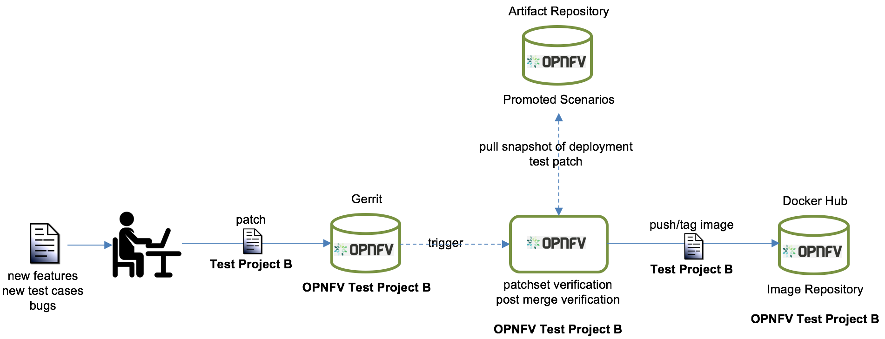
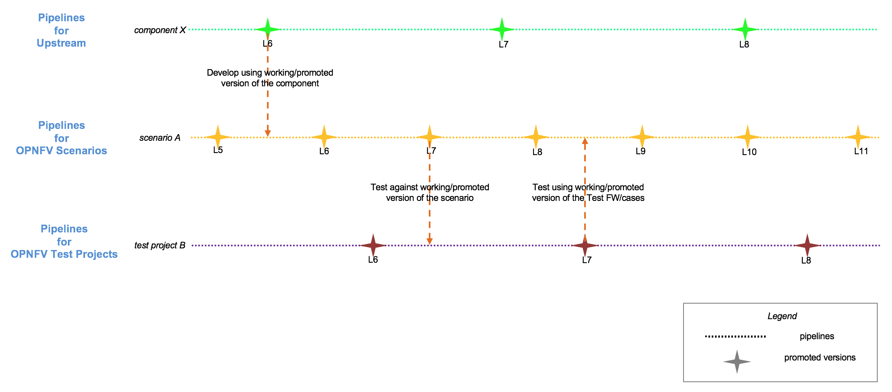

.. _xci-overview:

.. This work is licensed under a Creative Commons Attribution 4.0 International License.
.. SPDX-License-Identifier: CC-BY-4.0
.. (c) Fatih Degirmenci (fatih.degirmenci@ericsson.com)

======================================
Cross Community Continuous Integration
======================================

Introduction
============

OPNFV develops, operates, and maintains its Continuous Integration (CI) process
used by OPNFV community to develop, integrate, test and release the integrated
reference platform for NFV.

During past releases, OPNFV released different flavors (scenarios) of the
platform in an entirely automated fashion, resulting in feedback to OPNFV itself
and other communities OPNFV works with. This enabled the community to implement
new features, identify/fix bugs directly in corresponding
upstream communities.

The development and release model employed by OPNFV during the past releases
used stable versions of upstream components. This helps developers and users
who are focused on stability however requires a lot of time for development,
integration, and testing, thus resulting in a slower pace of innovation.

In order to increase the speed of development and evolution of the platform,
OPNFV needs to provide means for its developers and users. One of the ways to
achieve this is to ensure developers have access to the latest versions of the
upstream components they are developing, integrating, and testing.

Based on this need, OPNFV Infrastructure Working Group (Infra WG) started the
Cross Community Continuous Integration (XCI) initiative, bringing in a new
development and release model into OPNFV which is based on Continuous Delivery
and DevOps practices and principles.

Focus Areas
===========

Enabling Continuous Delivery
----------------------------

By definition, XCI focuses on master branches in order to

* shorten the time it takes to introduce new features
* make it easier to identify and fix bugs
* ease the effort to develop, integrate, and test the reference
  platform
* establish additional feedback loops within OPNFV, towards the users
  and between the communities OPNFV works with
* increase the visibility regarding the state of things at all times

XCI aims to enable this by applying basic CI/CD & DevOps principles and
following best practices such as

* fail fast, fix fast
* always have working software
* small and frequent commits
* work against the trunk, shortening development time
* fast and tailored feedback
* everything is visible to everyone all the time
* and others

By doing this, the overall quality of the platform components provided by the
upstream communities will increase greatly, making it easier for anyone to
consume them when they need them with less trouble, helping to find and fix bugs
much earlier than what it is today and develop new features.

How good this can work depends on the nature of the changes. If the changes are
atomic and more importantly complete, the value added by XCI will increase
significantly.

Putting Users and Developers First
----------------------------------

Apart from applying the principles and following the best practices, XCI puts
the users and developers first by pushing for

* less burden on developers as they do not need to be aware of all details that
  are not of their interest/concern
* reduced complexity
* an easy way to try and develop things
* speed, helping developers to bring their scenarios to OPNFV faster
* a real scenario ownership

The proof of the user and developer centric approach is that the first thing
XCI made available is the sandbox for users and developers to try things out.

Keeping Quality, Confidence and Predictability High
---------------------------------------------------

Another and perhaps the most crucial concern for XCI is to keep the quality high,
increase the confidence, have predictability, and have the availability of the
latest versions earlier. Some of the prerequisites to fulfill these goals are

* Test early and often
* Know the quality at all times
* Make the platform available early so people have time to develop, integrate,
  and test their work
* Avoid big bang uplifts
* Avoid surprises

Source Based Deployments
------------------------

CI starts on developer workstation and this is the fastest feedback a developer
can get. In order to ensure developers can apply this principle, they need the
tools and ways to enable fast development and test cycles that are repeatable as
many times as necessary without hassle.

One way to achieve this is to bring developers closer to the source and remove
anything between them. This means that what XCI brings is not only deploying from
upstream master branches but doing that from source with no intermediaries in between.

A simple scenario that demostrates the value of bringing capability of source based
deployments to OPNFV can be seen on the diagram below.

As you can see on the diagram, XCI provides tools and ways for developers to

* patch the source code on their laptop
* get the patch deployed to the stack with a single command
* run the tests
* fix if something is broken
* repeat the cycle until they are satisfied with it and have confidence in it
* send the patch for review and CI

This does not mean XCI will completely skip using artifacts. Artifact based
deployments will be available in later CI loops such as daily/weekly, but the
developer near loops will be run using source code.

Multi-distro Support
--------------------

Giving choice and not imposing things on developers and users are two
of the important aspects of XCI. This means that if they want to have smaller
deployments, they should be able to do that by using
:ref:`different flavors <sandbox-flavors>` provided by XCI.

Multi-distro support falls into same category for XCI; giving choice and making
sure people can pick and choose what Linux distribution they want to use.

XCI currently supports Ubuntu 16.04, CentOS 7, and openSUSE Leap 42.3 and the
choice is entirely left to the user.

Feature parity between the OPNFV scenarios on different Linux distributions
that are supported by XCI may vary and it is possible for OPNFV community
to work on bringing them to the same level.

XCI Pipelines
=============

Providing timely and tailored feedback is one of the most important things about
CI. It is important to make the feedback easily accessible and consumable for the
community so the issues can be analysed as quickly as possible and fixes can be
issued appropriately.

XCI focuses on feedback aspects of the CI and ensures that whatever feedback provided
to community makes sense rather than just pointing to some logs. In order to
achieve this, XCI enhances existing feedback loops and establishes new ones based on
who needs the feedback. XCI does this by its pipelines as listed below.

Pipelines for Upstream Projects
-------------------------------

OPNFV work upstream first which means that majority of the work is done in upstream
projects. The upstream projects OPNFV works with have CI pipelines for the code
contributed but the pipelines generally lack the testing that is important for
the OPNFV community.

XCI aims to provide patch level feedback and feedback based on the tip of the master
branches for the upstream projects. This means that if an OPNFV developer contributes
to an upstream project, it will be possible for developer to get additional feedback
from OPNFV XCI in order to ensure the contribution works in OPNFV context
as well. The level of testing will be adjusted based on the community needs and it
is important not to duplicate the testing done by the upstream communities in their
CI pipelines.

Apart from providing feedback to the developers, these pipelines will be used for
finding working versions of upstream components from their master branches to pin
them for development purposes.

Please note that the types and scope of testing done by XCI vary for different
projects and the work for enabling pipelines is still in progress which heavily
depends on the readiness of the upstream projects.

Pipelines for OPNFV Scenarios
-----------------------------

OPNFV CI has pipelines for scenarios constructed by the OPNFV projects. However
the existing pipelines have number of areas that require improvements.

The existing pipelines lack the granularity one might expect. This means that the
changes to the scenarios are either not tested properly or tested together with
unrelated scenarios, resulting in lack of testing or taking too much time to get
feedback.

Apart from the test coverage and the time it takes to test, scenarios are generally
tested on a daily basis on baremetal even if it may not be necessary and there are
no changes.

XCI will change how the feedback is provided for the scenarios by pushing scenario
ownership to corresponding projects and establishing loops for patchset verification,
daily and weekly tests. This means that if a scenario changes in a project repo,
verification for that scenario will directly be triggered and testing will be done using
virtual deployments, providing feedback to the project.

Daily and weekly loops will be run on baremetal if and only if the scenario is worth
testing on baremetal. This will be achieved by applying promotion concepts; if a
scenario passes virtual deployments, it will be tested by daily loops on baremetal
and by weekly loops later on.

Pipelines for OPNFV Test Projects
---------------------------------

OPNFV Test Projects generally lack the CI coverage they need. Most of the test projects
only have unit tests, resulting in faults slipping into platform testing, making it
harder for community to understand what really went wrong; for example, is there a
problem with the scenario itself or is the problem with the test framework/cases?

XCI aims to establish proper CI pipelines for the test projects by employing
virtual deployments, so any change that is done to test frameworks/cases
themselves will be tested against a real virtual deployment. The deployments
will be brought up using a verified version of the relevant scenario and via snapshots
so the patch verification will be relevant and quick. If the testing at this level fails,
it is most probably due to the patch itself rather than the scenario, preventing
faulty code from slipping into master branch of the test project. Further feedback loops,
such as post-merge, can be established depending on the needs of the community.

Pipelines for XCI Framework and Sandbox
---------------------------------------

XCI itself needs to be tested properly in order to ensure the changes to the framework
or the sandbox do not break anything for the community.

Putting All Together
--------------------

All the pipelines explained in earlier sections run in parallel and as independently
from each other as possible, providing feedback to relevant communities and people
so they can get the feedback that fit their purposes.

Output of these pipelines (verdicts, artifacts, and so on) are also used by each
of the pipelines appropriately, ensuring that the pipeline uses well tested versions
of artifacts they need.

An example of this could be the pipelines for OPNFV test projects and the pipelines
for the OPNFV scenarios. Pipelines for OPNFV projects need verified versions of the
scenarios to gate changes coming to test project repositories so they can be tested
in isolation. This means that whatever goes wrong during the gate is probably due to
change itself and not because of the scenario since the scenario is tested long before
and promoted to test pipeline to be used for gating.

Similar thing is valid for the OPNFV scenarios as well; the pipelines
need verified versions of test frameworks/cases so when scenario is put on a baremetal
and tested, only thing that really changed and possibily of causing a failure
is the scenario itself.

How to Get Involved
===================

OPNFV XCI is an initiative driven by OPNFV community and receives contributions from
various open source communities such as `OpenStack <https://www.openstack.org/>`_ and
`OpenDaylight <https://www.opendaylight.org/>`_.

Anyone can contribute to XCI by trying the :ref:`XCI Sandbox <xci-user-guide>`, issuing
bug reports, updating the documentation, or contributing the code.

You can get in touch with XCI developers on ``#opnfv-pharos`` IRC channel
on Freenode or send mail to ``opnfv-users@lists.opnfv.org`` for any questions
you might have.
