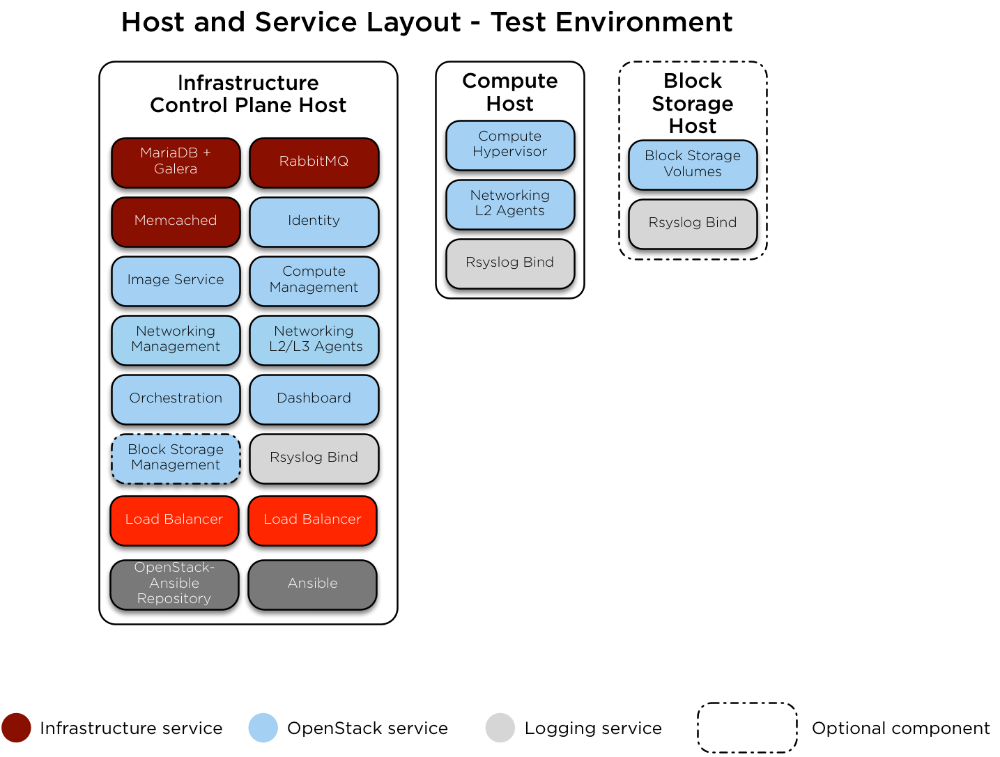

.. _xci-user-guide:

.. This work is licensed under a Creative Commons Attribution 4.0 International License.
.. SPDX-License-Identifier: CC-BY-4.0
.. (c) Fatih Degirmenci (fatih.degirmenci@ericsson.com)

======================
Sandbox and User Guide
======================

The Sandbox
===========

Users and developers need to have an easy way to bring up an environment that
fits their purpose in a simple way so they can spend time on features they
are developing, bugs they are fixing, trying things out, for learning purposes
or just for fun rather than dealing with tools and mechanisms used for
creating and provisioning nodes, installing different components they do not
intend to touch, etc.

However, we also have to deal with reality. For example, not all users and developers
have full Pharos baremetal PODs or powerful machines available for their
work or they may want to use different Linux distributions for different reasons.
It is important to take these into account and provide different configuration
options for the sandbox based on the requirements that people have on the
environment they will be using.

Based on the observations we made and the feedback we received from the OPNFV
users and developers, XCI Team has created a sandbox that is highly
configurable, simple and at the same time capable of providing a realistic
environment for people to do their work. The sandbox makes it possible to
bring up the complete environment with a single command and offers a variety of
options to change how the stack should be deployed. The configuration of the
sandbox is as easy as setting a few environment variables.

The sandbox provides

* automated way to bring up and tear down a complete stack
* various flavors to pick and use
* support for different Linux distributions
* multiple OPNFV scenarios to install
* ability to select different versions of upstream components to base the work on
* ability to enable additional OpenStack services or disable others
* ability to install kubernetes with different network plugins

One last point to highlight here is that the XCI itself uses the sandbox for
development and test purposes so it is continuously tested to ensure it works
for XCI and for users and developers who are using it for different
purposes.

Components of the Sandbox
===================================

The sandbox uses OpenStack tools for VM node creation and provisioning.
OpenStack and Kubernetes installations are done using the tools from corresponding
upstream projects with no changes to them. XCI Team provides playbooks,
roles, and scripts to ensure the components utilized by the sandbox
work in a way that serves the users in the best possible way.

* **openstack/bifrost:** Bifrost (pronounced bye-frost) is a set of Ansible
  playbooks that automates the task of deploying a base image onto a set
  of known hardware using Ironic. It provides modular utility for one-off
  operating system deployment with as few operational requirements as
  reasonably possible. Bifrost supports different operating systems such as
  Ubuntu, CentOS, and openSUSE.
  More information about this project can be seen on
  `Bifrost documentation <https://docs.openstack.org/developer/bifrost/>`_.

* **openstack/openstack-ansible:** OpenStack-Ansible is an official OpenStack
  project which aims to deploy production environments from source in a way
  that makes it scalable while also being simple to operate, upgrade, and grow.
  More information about this project can be seen on
  `OpenStack Ansible documentation <https://docs.openstack.org/developer/openstack-ansible/>`_.

* **kubernetes-incubator/kubespray:** Kubespray is a composition of Ansible playbooks,
  inventory, provisioning tools, and domain knowledge for generic Kubernetes
  clusters configuration management tasks. The aim of kubespray is deploying a
  production ready Kubernetes cluster.
  More information about this project can be seen on
  `Kubespray documentation <https://kubernetes.io/docs/getting-started-guides/kubespray/>`_.

* **opnfv/releng-xci:** OPNFV Releng Project provides additional scripts, Ansible
  playbooks and configuration options in order for developers to have an easy
  way of using openstack/bifrost and openstack/openstack-ansible by just
  setting a couple of environment variables and executing a single script.
  More infromation about this project can be seen on
  `OPNFV Releng documentation <https://wiki.opnfv.org/display/releng>`_.

Sandbox Flavors
===============

XCI Developer Sandbox provides 4 different configurations (flavors) that can be
deployed using VM nodes.

Available flavors are listed on the table below.

+------------------+------------------------+---------------------+--------------------------+--------------------------+
| Flavor           | Number of VM Nodes     | VM Specs Per Node   | Time Estimates Openstack | Time Estimates Kubernetes|
+==================+========================+=====================+==========================+==========================+
| Mini             | | 3 VM Nodes           | | vCPUs: 6          | | Provisioning: 12 mins  | | Provisioning: 12 mins  |
|                  | | 1 deployment node    | | RAM: 12GB         | | Deployment: 65 mins    | | Deployment: 35 mins    |
|                  | | 1 controller node    | | Disk: 80GB        | | Total: 77 mins         | | Total: 47 mins         |
|                  | | 1 compute node       | | NICs: 1           | |                        | |                        |
+------------------+------------------------+---------------------+--------------------------+--------------------------+
| No HA            | | 4 VM Nodes           | | vCPUs: 6          | | Provisioning: 12 mins  | | Provisioning: 12 mins  |
|                  | | 1 deployment node    | | RAM: 12GB         | | Deployment: 70 mins    | | Deployment: 35 mins    |
|                  | | 1 controller node    | | Disk: 80GB        | | Total: 82 mins         | | Total: 47 mins         |
|                  | | 2 compute nodes      | | NICs: 1           | |                        | |                        |
+------------------+------------------------+---------------------+--------------------------+--------------------------+
| HA               | | 6 VM Nodes           | | vCPUs: 6          | | Provisioning: 15 mins  | | Provisioning: 15 mins  |
|                  | | 1 deployment node    | | RAM: 12GB         | | Deployment: 105 mins   | | Deployment: 40 mins    |
|                  | | 3 controller nodes   | | Disk: 80GB        | | Total: 120 mins        | | Total: 55 mins         |
|                  | | 2 compute nodes      | | NICs: 1           | |                        | |                        |
+------------------+------------------------+---------------------+--------------------------+--------------------------+

The specs for VMs are configurable and the more vCPU/RAM the better.

Estimated times listed above are provided as a guidance and they might vary
depending on

* the physical (or virtual) host where the sandbox is run
* the specs of the VM nodes
* the Linux distribution
* whether the boot images are recreated or not
* installed/activated OpenStack services
* internet connection bandwidth

Flavor Layouts - OpenStack Based Deployments
--------------------------------------------

All flavors are created and deployed based on the upstream OpenStack Ansible (OSA)
guidelines.

Network configuration on the nodes are same no matter which flavor is used.
The VMs are attached to default libvirt network and has single NIC where VLANs
are created on. Different Linux bridges for management, storage and tunnel
networks are created on these VLANs.

Use of more *production-like* network setup with multiple interfaces is in our
backlog. Enabling OVS as default is currently in progress.

For storage, Cinder with NFS backend is used. Work to enable CEPH is currently
ongoing.

The differences between the flavors are documented below.

**Mini/No HA/HA**

These flavors consist of multiple nodes.

* **opnfv**: This node is used for driving the installation towards target nodes
  in order to ensure the deployment process is isolated from the physical host
  and always done on a clean machine.
* **controller**: OpenStack control plane runs on this node.
* **compute**: OpenStack compute service runs on this node.

Please see the diagram below for the host and service layout for these
flavors.

Flavor Layouts - Kubernetes Based Deployments
---------------------------------------------

All flavors are created and deployed based on the upstream kubespray guidelines.

For network plugins, calico is used. flannel, weaver, contive, canal and cilium
are supported currently

The differences between the flavors are documented below.

**Mini/No HA/HA**

These flavors consist of multiple nodes.

* **opnfv**: This node is used for driving the installation towards target nodes
  in order to ensure the deployment process is isolated from the physical host
  and always done on a clean machine.
* **master**:  provide the kubernetes cluster’s control plane.
* **node**: a worker machine in Kubernetes, previously known as a minion.

HA flavor has 3 master nodes and a load balancer is set up as part of the deployment process.
The access to the Kubernetes cluster is done through the load balancer.

Please see the diagrams below for the host and service layout for these
flavors.

.. image:: images/arch-layout-k8s-noha.png
   :scale: 75 %

User Guide
==========

Prerequisites
-------------

* A machine with sufficient CPU/RAM/Disk based on the chosen flavor
* Ubuntu 16.04, OpenSUSE Leap 42.3, or CentOS 7
* CPU/motherboard that supports hardware-assisted virtualization
* Passwordless sudo
* An SSH key generated for your user (ie ~/.ssh/id_rsa)
* Packages to install

  * git
  * python 2.7
  * pip
  * libvirt

How to Use
----------

**Basic Usage**

1. If you don't have one already, generate an SSH key in $HOME/.ssh

   | ``ssh-keygen -t rsa``

2. Clone OPNFV releng-xci repository

   | ``git clone https://gerrit.opnfv.org/gerrit/releng-xci.git``

3. Change into directory where the sandbox script is located

   | ``cd releng-xci/xci``

4. If you want to deploy Kubernetes based scenario, set the variables as below. Otherwise skip.

   | ``export INSTALLER_TYPE=kubespray``
   | ``export DEPLOY_SCENARIO=k8-nosdn-nofeature``

5. Execute the sandbox script

   | ``./xci-deploy.sh``

Issuing above command will start the sandbox deployment using the default
flavor ``mini`` and the verified versions of upstream components.
(`pinned-versions <https://git.opnfv.org/releng-xci/tree/xci/config/pinned-versions>`_).
The sandbox should be ready between 1,5 and 2 hours depending on the host
machine.

After the script finishes execution, you can login to ``opnfv`` host and start
using your new deployment.

The openrc file will be available on ``opnfv`` host in ``$HOME``.

**Advanced Usage**

The flavor to deploy and the versions of upstream components to use can
be configured by the users by setting certain environment variables.
Below example deploys noha flavor using the latest of openstack-ansible
master branch and stores logs in different location than what is set as
default.

1. If you don't have one already, generate an SSH key in $HOME/.ssh

   | ``ssh-keygen -t rsa``

2. Clone OPNFV releng-xci repository

   | ``git clone https://gerrit.opnfv.org/gerrit/releng-xci.git``

3. Change into directory where the sandbox script is located

   | ``cd releng-xci/xci``

4. Set the sandbox flavor

   | ``export XCI_FLAVOR=noha``

5. Set the version to use for openstack-ansible

   1) if deploying OpenStack based scenario

   | ``export OPENSTACK_OSA_VERSION=master``

   2) if deploying Kubernetes based scenario

   | ``export KUBESPRAY_VERSION=master``

6. Set where the logs should be stored

   | ``export LOG_PATH=/home/jenkins/xcilogs``

7. Execute the sandbox script

   | ``./xci-deploy.sh``

Please note that changing the version to use may result in unexpected
behaviors, especially if it is changed to ``master``. If you are not
sure about how good the version you intend to use is, it is advisable to
use the pinned versions instead.

**Verifying the Openstack Basic Operation**

You can verify the basic operation using the commands below.

1. Login to opnfv host

   | ``ssh root@192.168.122.2``

2. Source openrc file

   | ``source openrc``

3. Issue OpenStack commands

   | ``openstack service list``

You can also access the Horizon UI by using the URL, username, and
the password displayed on your console upon the completion of the
deployment.

**Verifying the Kubernetes Basic Operation**

You can verify the basic operation using the commands below.

1. Login to opnfv host

   | ``ssh root@192.168.122.2``

2. Issue kubectl commands

   | ``kubectl get nodes``

You can also access the Kubernetes Dashboard UI by using the URL,
username, and the password displayed on your console upon the
completion of the deployment.

**Debugging Tips**

If ``xci-deploy.sh`` fails midway through and you happen to fix whatever
problem caused the failure in the first place, please run
the script again. Do not attempt to continue the deployment using helper
scripts such as ``bifrost-provision.sh``.

Look at various logs in ``$LOG_PATH`` directory. (default one is /tmp/.xci-deploy-env/opnfv/logs)

Behind the Scenes
-----------------

Here are steps that take place upon the execution of the sandbox script
``xci-deploy.sh``:

1. Sources environment variables in order to set things up properly.
2. Installs ansible on the host where sandbox script is executed.
3. Creates and provisions VM nodes based on the flavor chosen by the user.
4. Configures the host where the sandbox script is executed.
5. Configures the deployment host which the OpenStack/Kubernetes
   installation will be driven from.
6. Configures the target hosts where OpenStack/Kubernetes will be installed.
7. Configures the target hosts as controller(s)/compute(s) or master(s)/worker(s)
   depending on the deployed scenario.
8. Starts the OpenStack/Kubernetes installation.

User Variables
--------------

All user variables can be set from command line by exporting them before
executing the script. The current user variables can be seen from
`user-vars <https://git.opnfv.org/releng-xci/tree/xci/config/user-vars>`_
file located in releng-xci repository.

Pinned Versions
---------------

As explained earlier, the users can pick and choose which versions to use. If
you want to be on the safe side, you can use the pinned versions the sandbox
provides. They can be seen from
`pinned-versions <https://git.opnfv.org/releng-xci/tree/xci/config/pinned-versions>`_.

OPNFV runs periodic jobs against upstream projects openstack/bifrost and
openstack/openstack-ansible using the latest on master branch, continuously
chasing upstream to find a well working version.

Once a working version is identified, the versions of the upstream components
are then bumped in releng-xci repo.

Further Information
-------------------

If you intend to use the sandbox in more advanced ways or if you are developing
XCI itself or an OPNFV scenario, please refer to
:ref:`XCI Developer Guide <xci-developer-guide>`.

Limitations, Known Issues, and Improvements
===========================================

The complete list can be seen using `this link <https://jira.opnfv.org/issues/?filter=11616>`_.

Changelog
=========

Changelog can be seen using `this link <https://jira.opnfv.org/issues/?filter=11625>`_.

Testing
=======

Sandbox is continuously tested by OPNFV XCI to ensure the changes do not impact
users. In fact, OPNFV XCI itself uses the sandbox to ensure it is always in
working state.

Support
=======

OPNFV XCI issues are tracked in OPNFV JIRA Releng project. If you encounter
an issue or identify a bug, please submit an issue to JIRA using
`this link <https://jira.opnfv.org/projects/RELENG>`_. Please label the issue
you are submitting with ``xci`` label.

If you have questions or comments, you can ask them on the ``#opnfv-pharos`` IRC
channel on Freenode.

References
==========

* `Bifrost Documentation <https://docs.openstack.org/bifrost/latest/>`_
* `OpenStack Ansible Documentation <https://docs.openstack.org/openstack-ansible/latest/>`_
* `OPNFV Releng Documentation <https://wiki.opnfv.org/display/releng>`_
